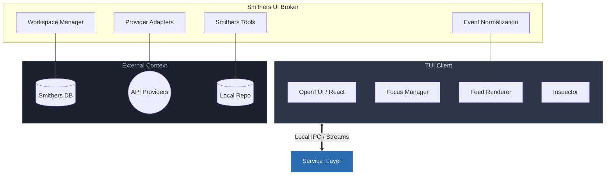
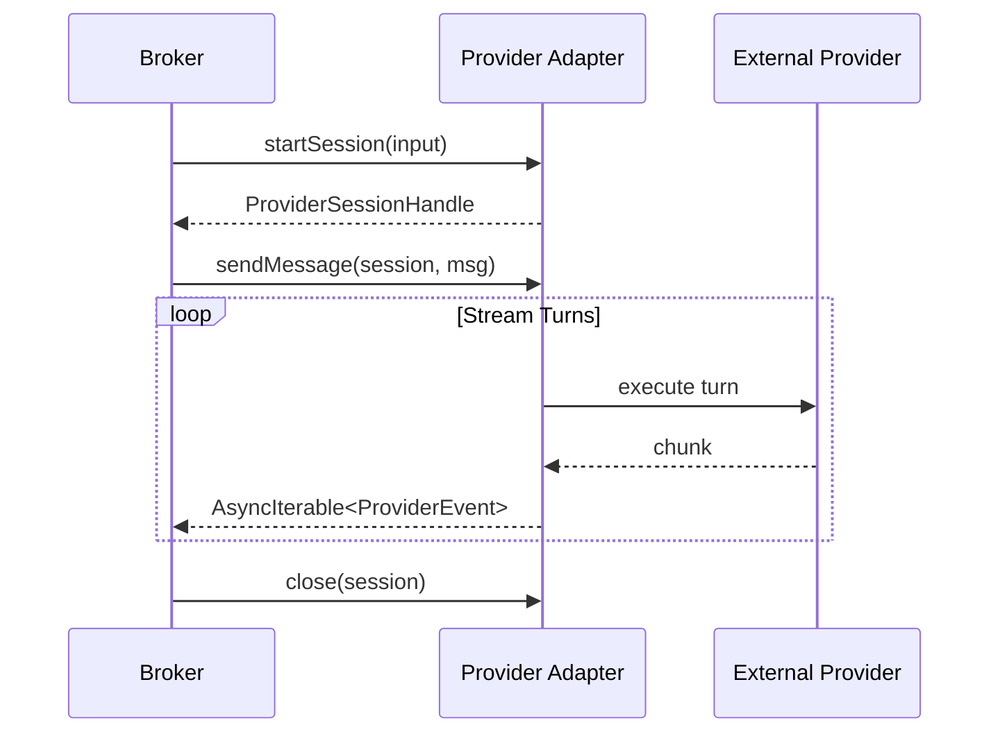

# Smithers TUI v2 — Engineering Design

Version: 1.0  
Status: Proposed

## 1. Executive recommendation

Do not evolve the current TUI architecture incrementally.

The current implementation is valuable as a source of components and domain knowledge, but its structure is fundamentally optimized for a read-only dashboard:
- view-local polling
- view-local keyboard handlers
- detached subprocess actions
- weak persistence for interactive sessions
- no event-stream abstraction
- no durable workspace/session model

V2 should be built as a new architecture with:
1. a broker/service layer for long-running sessions and provider streams
2. a unified event model for chat, runs, tools, approvals, and artifacts
3. a central input router and focus manager
4. a persistent workspace/session store
5. a renderer shell built on reusable terminal components

## 2. Current-state assessment

The current TUI stack is:
- React
- OpenTUI renderer
- SmithersDb polling
- scattered `useKeyboard()` handlers
- detached `Bun.spawn()` side effects for actions

That is sufficient for read-only observability and insufficient for a polished chat-first orchestration console.

Architectural problems to fix:
- components own both rendering and data-refresh policy
- polling cadence is embedded in views
- input handling is context-fragmented
- subprocess lifecycle is not centrally supervised
- streaming is effectively shelling out
- there is no durable concept of workspace/session independent of runs

## 3. Proposed system architecture

### 3.1 High-level shape



## 3.2 Why a broker exists

The TUI process should not directly own all long-running provider processes.

Reasons:
- durable background work must outlive the terminal view
- the UI should be able to crash and reconnect
- process supervision should be centralized
- streaming normalization belongs outside the view layer
- clipboard/attachment ingest and notifications need OS integration boundaries
- multiple future frontends can reuse the same broker

## 3.3 Deployment shape

Recommended initial implementation:
- broker runs in-process when launched normally
- broker can be detached into a background daemon later
- reconnect protocol exists from day one, even if the first release launches broker alongside the client

CLI surface:
- `smithers tui` -> start broker if needed, attach client
- `smithers tui --attach`
- `smithers tui --broker-only` for debugging

## 4. Technology choices

## 4.1 Renderer

Recommendation:
- keep React + OpenTUI for v2 client rendering
- isolate renderer behind a shell/component boundary so migration is possible

Why not rewrite renderer immediately:
- TypeScript/Bun codebase alignment
- existing components and knowledge remain useful
- OpenTUI is not the root problem; interaction architecture is

Required discipline:
- no domain polling inside presentational components
- no direct process spawning from components
- no view-local global key capture

## 4.2 State management

Use two layers:

### A. Domain store
A centralized app store for:
- workspaces
- feed entries
- inspector state
- run summaries
- notifications
- attachments
- provider profiles

A simple reducer/store is preferable to ad hoc React state. Zustand is acceptable. A custom reducer store is also acceptable.

### B. UI mode / overlay state machine
Use an explicit finite-state model for:
- focus region
- overlays
- palette
- help
- large-paste dialog
- approval dialog
- live-follow vs paused-follow

> [!TIP]
> A state machine library is acceptable, but a small explicit auto-reducer FSM is preferred to keep the surface area small and disciplined.

## 4.3 Streams and async

Use Effect/Stream style pipelines or an equivalent typed async event stream layer for:
- provider token streaming
- Smithers run event tailing
- notifications
- reconnect / heartbeats
- log and artifact updates

The important point is not the library. The important point is to normalize every long-running source into one event protocol.

## 5. Domain model

## 5.1 Core types

```ts
type WorkspaceId = string
type FeedEntryId = string
type RunId = string
type ProviderProfileId = string
type AttachmentId = string

type WorkspaceMode = "operator" | "plan" | "direct"

type FeedEntryType =
  | "user"
  | "assistant"
  | "tool"
  | "run"
  | "approval"
  | "artifact"
  | "diff"
  | "warning"
  | "error"
  | "summary"

interface Workspace {
  id: WorkspaceId
  title: string
  cwd: string
  repoRoot: string
  mode: WorkspaceMode
  providerProfileId: ProviderProfileId
  sessionId: string
  unreadCount: number
  attention: "none" | "running" | "approval" | "failed" | "complete"
  pinnedContext: AttachmentId[]
  linkedRuns: RunId[]
  queuedMessages: QueuedMessage[]
  draft: ComposerDraft
  selection: WorkspaceSelectionState
  createdAtMs: number
  updatedAtMs: number
}

interface FeedEntry {
  id: FeedEntryId
  workspaceId: WorkspaceId
  type: FeedEntryType
  timestampMs: number
  source: string
  summary: string
  body?: RichTextBlock[]
  status?: "running" | "done" | "failed" | "waiting"
  relatedRunId?: RunId
  relatedWorkflowId?: string
  relatedAttachmentIds?: AttachmentId[]
  expanded: boolean
  metadata: Record<string, unknown>
}

interface RunSummary {
  runId: RunId
  workflowId: string
  status: string
  startedAtMs?: number
  finishedAtMs?: number
  currentNodeId?: string
  completedSteps?: number
  totalSteps?: number
  approvalPending?: boolean
  providerProfileId?: string
  tokenUsage?: TokenUsage
  cost?: number
}

interface ProviderProfile {
  id: ProviderProfileId
  name: string
  route: ProviderRoute[]
  defaultMode: WorkspaceMode
  capabilities: CapabilityFlags
  costPolicy: "cheap-first" | "balanced" | "best-quality"
}

interface AttachmentRef {
  id: AttachmentId
  kind: "file" | "dir" | "image" | "snippet" | "run" | "workflow" | "session"
  display: string
  path?: string
  mimeType?: string
  bytes?: number
  tokenEstimate?: number
  lazy: boolean
}
```

## 5.2 Event protocol

All live activity should reduce to a single event envelope.

```ts
interface UiEventEnvelope {
  seq: number
  workspaceId: WorkspaceId
  timeMs: number
  source:
    | "provider"
    | "smithers"
    | "system"
    | "user"
    | "broker"
  kind:
    | "token_delta"
    | "message_done"
    | "tool_started"
    | "tool_updated"
    | "tool_done"
    | "run_started"
    | "run_updated"
    | "run_finished"
    | "approval_requested"
    | "approval_resolved"
    | "artifact_created"
    | "notification"
    | "error"
    | "selection_hint"
  payload: unknown
}
```

Requirements:
- monotonic sequence numbers
- replayable from persistence
- idempotent application
- snapshot + tail recovery

## 6. Broker internals

## 6.1 Services

The broker should expose these internal services:

### WorkspaceService
- create/open/close/archive workspaces
- restore drafts and selection
- persist session tree

### FeedService
- normalize domain events into feed entries
- compact verbose streams into summaries
- group repeated tool calls

### ProviderService
- create provider sessions
- stream turns
- cancel / retry
- expose capabilities
- map provider-native events into broker events

### SmithersService
- list/discover workflows
- inspect workflow metadata
- launch/resume/cancel runs
- stream run events
- inspect approvals
- query telemetry and DB summaries

### AttachmentService
- file index
- mention resolution
- binary detection
- image ingest
- token estimation
- large-paste handling

### NotificationService
- in-app badges
- OSC / bell / desktop notification bridge
- suppression rules

### PersistenceService
- workspace/session/feed state
- reconnection cursor
- migrations

## 6.2 Process supervision

The broker owns all provider subprocesses and long-running tasks.

Requirements:
- restartable supervisors
- typed lifecycle states
- backoff and timeout policies
- clean cancellation
- stdout/stderr capture
- terminal-safe cleanup on crash

Do not allow:
- React components spawning ad hoc subprocesses
- detached shells without supervision metadata
- provider streams that cannot be resumed or at least reported as terminated

## 7. Provider abstraction

## 7.1 Adapter interface

Unify harness-backed and API-backed providers.



```ts
interface ProviderAdapter {
  id: string
  kind: "harness" | "api"
  capabilities(): CapabilityFlags
  startSession(input: StartSessionInput): Promise<ProviderSessionHandle>
  sendMessage(sessionId: string, input: ProviderMessageInput): AsyncIterable<ProviderEvent>
  cancel(sessionId: string): Promise<void>
  close(sessionId: string): Promise<void>
}
```

## 7.2 Capability flags

```ts
interface CapabilityFlags {
  directFileEdit: boolean
  shell: boolean
  imageInput: boolean
  streaming: boolean
  toolCalling: boolean
  multiTurn: boolean
  supportsResume: boolean
  explicitCost: boolean
}
```

## 7.3 Routing policy

A provider profile can route by task class.

Example:
- repo scan -> AI SDK / cheap model
- workflow generation -> API strong model
- repo implementation via harness -> Claude Code or Codex
- final summary -> cheap model

This routing policy should be visible in the UI and editable later.

## 7.4 Provider session model

A workspace may contain:
- one primary operator session
- zero or more child worker sessions
- zero or more linked Smithers runs

These child sessions do not all need to be visually rendered in separate panes. They do need durable identities and feed items.

## 8. Smithers-aware tool layer

## 8.1 Required tool surface

The default assistant should have tools for:

### Discovery
- list workflows
- read workflow source / metadata
- list runs
- inspect a run
- query recent failures
- search Smithers docs

### Execution
- launch workflow
- resume run
- cancel run
- approve / deny gate
- attach to run
- tail run logs/events

### Repo context
- find files
- read files
- inspect git status
- summarize repo structure

### Workflow authoring
- scaffold `.smithers/workflows/*`
- refactor shared Smithers helpers
- validate workflow schema
- run smoke test / dry run

### Utilities
- telemetry summary
- data grid query
- triggers list/manage

## 8.2 Workflow-first prompt policy

The default operator system prompt should explicitly instruct:

- inspect `.smithers/workflows/` before inventing new flow
- prefer reusable Smithers scripts and helpers
- factor repeated steps into shared components
- write outside `.smithers/` only when necessary or explicitly requested
- launch durable runs for non-trivial work
- keep the user informed via run and artifact references

## 8.3 Suggested default system prompt

```text
You are Smithers Operator for this repository.

Your job is to solve tasks by orchestrating Smithers workflows and scripts, not by acting like a generic direct-edit coding harness.

Default behavior:
1. Inspect existing `.smithers/workflows/` and related helpers first.
2. Reuse or refactor shared Smithers components when patterns repeat.
3. Prefer writing or modifying reusable workflows/scripts in `.smithers/`.
4. Prefer launching Smithers runs for non-trivial work and monitor them.
5. Surface run IDs, approvals, artifacts, and failures clearly.
6. Use cheaper API providers for broad analysis when appropriate.
7. Escalate to harness-backed workers only when agentic repo operations are needed.
8. Avoid direct edits outside `.smithers/` unless the user explicitly asks or the task is too small to justify a workflow.
9. When you do create one-off automation, make it easy to promote into a reusable workflow.
```

## 9. Input architecture

## 9.1 Central key router

Build a single key router with:
- current focus region
- active overlay stack
- composer editing state
- keymap registry
- context-sensitive command lookup

Rules:
- a key is resolved against overlay first, then focused region, then global bindings
- every command has metadata: id, label, context, destructive, handler
- help UI is generated from the registry, not hand-maintained

## 9.2 Keymap design

Each command definition should include:

```ts
interface CommandDef {
  id: string
  label: string
  contexts: string[]
  defaultKeys: string[]
  palette: boolean
  destructive?: boolean
  handler: (ctx: CommandContext) => Promise<void> | void
}
```

This allows:
- searchable help
- contextual action menus
- remapping
- discoverable palette entries

## 9.3 Composer engine

Do not rely entirely on the basic terminal input widget.

Implement or extend a proper text buffer supporting:
- multiline editing
- grapheme-aware cursor motion
- word motion
- kill/yank
- selection future-proofing
- paste interception
- structured mention chips
- queued follow-up metadata

## 9.4 Paste interception

Needed to handle large text and images gracefully.

Flow:
1. detect paste burst
2. measure size / lines / probable type
3. if under threshold, insert inline
4. if over threshold, open ingest dialog
5. if binary or image path/clipboard image, create attachment reference

## 10. Attachment and context pipeline

## 10.1 File indexing

Use a background indexer over:
- `git ls-files`
- untracked but visible files
- ignore rules from `.gitignore`

Features:
- fuzzy path search
- file type metadata
- binary detection
- size and token estimate
- recent files boost

## 10.2 Image pipeline

Requirements:
- path attachment for images
- clipboard image ingest when supported by OS helpers
- drag/drop path handling when terminal emits file paths
- inline preview only in terminals that support graphics
- otherwise show metadata pill and allow open externally

Do not block send on inline preview support.

## 10.3 Large file strategy

For large files:
- attach by reference
- read lazily
- summarize slices as needed
- show explicit token budget impact

Binary strategy:
- never dump raw binary into prompt
- offer metadata + optional external open

## 11. Feed rendering and performance

## 11.1 Virtualization

Implement windowed rendering for the feed and long inspectors.

Requirements:
- only render visible rows plus overscan
- stable row identity by entry id
- height measurement cache for wrapped content
- stream updates patch the active row, not rerender the entire feed

## 11.2 Grouping and compaction

Needed for:
- repeated read calls
- long log bursts
- repetitive run status deltas
- streaming token output

Broker should emit:
- fine-grained raw events
- higher-level grouped feed summaries

The client can expand grouped summaries on demand.

## 11.3 Log and diff viewers

Use dedicated viewers for:
- large logs
- large diffs
- raw JSON
- SQL results

These should be openable in:
- inline inspector
- fullscreen overlay
- external pager

## 12. Persistence

## 12.1 Storage location

Recommendation:
- create a separate UI persistence DB under project-local Smithers state, not inside core workflow tables

Example shape:
- `.smithers/state/ui.db`

Reason:
- UI state and orchestration state should be related but not tightly coupled
- allows faster UI schema evolution
- avoids polluting domain workflow DB tables

## 12.2 Tables

Suggested:
- `ui_workspaces`
- `ui_sessions`
- `ui_feed_entries`
- `ui_attachments`
- `ui_notifications`
- `ui_keybindings`
- `ui_profiles`
- `ui_reconnect_state`

Use WAL mode and explicit migrations.

## 12.3 Recovery

Persist:
- last active workspace
- draft text
- attachment chips
- inspector tab
- follow mode
- selected feed entry
- pending queued messages
- broker reconnect cursor

## 13. Notifications

## 13.1 In-app
- workspace badges
- approval counts
- failure markers
- latest attention summary

## 13.2 Terminal / OS
Support:
- bell
- OSC notifications when appropriate
- desktop notifications via platform bridge

Suppression:
- do not notify if the relevant workspace is currently focused
- allow repo/workspace-level mute

## 13.3 Jump actions
Provide:
- “jump to latest approval”
- “jump to latest failure”
- “jump to latest unread completion”

## 14. Security and permissions

## 14.1 Modes
- `plan`: read-only
- `operator`: workflow-first, direct writes restricted
- `direct`: direct edits allowed

## 14.2 Direct write restrictions
By default in operator mode:
- allow writes in `.smithers/`
- ask for writes outside `.smithers/`
- ask for destructive shell
- explicit approval for push/delete/network-sensitive actions

## 14.3 Approval audit
Persist:
- approval request
- decision
- user or rule responsible
- timestamp
- scope (`once`, `workspace`, `profile`)

## 15. Utilities migration

The current utility screens should survive, but not as the shell.

Map them as follows:
- Runs list -> run board + inspector
- Agent console -> main feed
- Triggers -> utility overlay
- Telemetry -> utility overlay
- Data grid -> utility overlay

The legacy node/run detail functionality should be reused as inspector modules where possible.

## 16. Testing strategy

## 16.1 Unit
- reducers
- key routing
- command registry
- feed grouping
- mention parsing
- attachment ingest decisions
- provider event normalization

## 16.2 Component snapshot / golden
- workspace rail
- feed rows
- overlays
- inspector tabs
- theme rendering
- narrow/wide layout snapshots

## 16.3 PTY integration
Run the TUI in a pseudo-terminal and test:
- focus movement
- palette flows
- workflow mention picker
- large paste guard
- run monitoring
- approval dialogs
- recovery after resize

## 16.4 Broker integration
Mock providers and Smithers services to verify:
- stream ordering
- reconnect
- cancellation
- queued messages
- run attachment

## 16.5 Chaos / resilience
- kill provider process mid-stream
- broker restart while client attached
- huge log flood
- repeated resize
- attachment failure
- corrupted session restore entry
- terminal cleanup on unhandled exception

## 17. Migration plan

## 17.1 Phase 0 — extract domain adapters
- isolate SmithersDb access behind services
- isolate CLI action spawning behind command handlers
- define event envelopes and state types

## 17.2 Phase 1 — ship new shell behind flag
- workspace rail
- feed shell
- command palette
- composer
- basic broker loop
- no legacy tabs in main shell

## 17.3 Phase 2 — run and approval integration
- live runs in feed
- inspector tabs
- approval dialogs
- notifications
- reconnect

## 17.4 Phase 3 — workflow-native layer
- `#workflow`
- workflow catalog
- schema-aware launch
- workflow scaffold/refactor actions

## 17.5 Phase 4 — legacy utility migration
- triggers
- telemetry
- datagrid
- old detail panes rehomed into overlays/inspectors

## 18. File/package layout suggestion

```text
src/cli/tui-v2/
  broker/
    Broker.ts
    WorkspaceService.ts
    FeedService.ts
    ProviderService.ts
    SmithersService.ts
    AttachmentService.ts
    NotificationService.ts
    PersistenceService.ts
  client/
    app/
      TuiApp.tsx
      Shell.tsx
      FocusManager.ts
      CommandRegistry.ts
      keymaps.ts
    components/
      WorkspaceRail.tsx
      Feed.tsx
      FeedRow/
      Inspector/
      Composer/
      Palette/
      Overlays/
    state/
      store.ts
      reducers.ts
      selectors.ts
      fsm.ts
    views/
      WorkflowCatalog.tsx
      RunBoard.tsx
      ApprovalInbox.tsx
      TelemetryView.tsx
      DataGridView.tsx
  providers/
    claudeCode.ts
    codex.ts
    gemini.ts
    aiSdk.ts
  smithers/
    workflows.ts
    runs.ts
    approvals.ts
    telemetry.ts
    docs.ts
  shared/
    types.ts
    events.ts
    commands.ts
    format.ts
```

## 19. Engineering decisions to enforce

Enforce:
- all commands registered centrally
- all external effects routed through broker/services
- all live activity mapped to one event protocol
- all keyboard help generated from command metadata
- all destructive operations visible and confirmable
- all session state persisted
- all large/verbose outputs collapsed or virtualized

## 20. Things not to do

Do not:
- bolt streaming chat onto the current tabbed app
- keep polling loops inside visual components
- let every view own its own keyboard worldview
- treat workflow runs and assistant turns as separate UI universes
- implement image support as “best effort paste bytes into input”
- rely on raw subprocess stdout as the only interface for provider events
- bury approvals in logs
