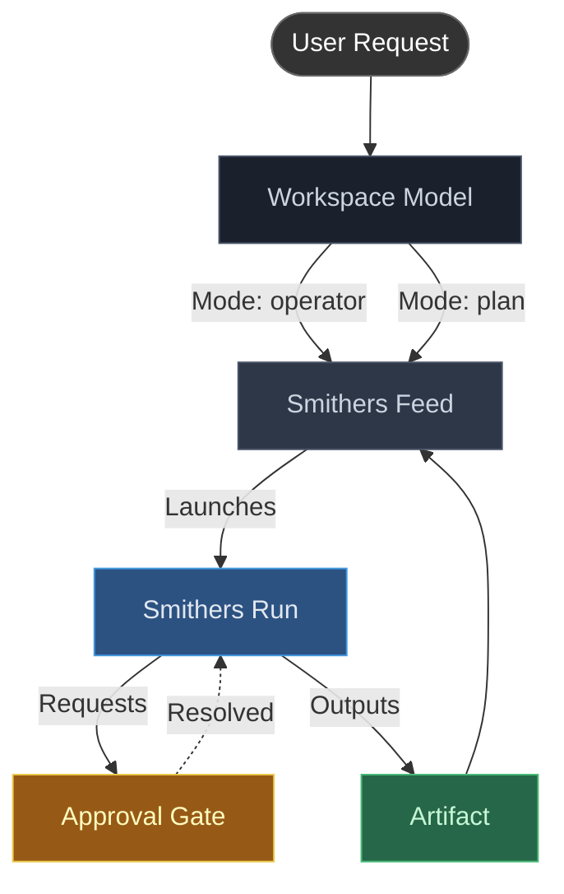

# Smithers TUI v2 — Product Requirements Document

Version: 1.0  
Status: Proposed  
Owner: Smithers

## 1. Executive summary

Smithers TUI v2 should not be an upgraded dashboard. It should be a chat-first control plane for Smithers-aware coding work.

The current TUI is useful as an observability surface, but it is structurally a read-only dashboard with view-local polling, tab-driven navigation, and action keys attached to individual screens. That architecture is fine for a proof of concept and wrong for the next product stage. V2 should be rebuilt around a durable workspace model, a unified activity feed, a workflow catalog, and a live run/approval monitor.

The product thesis is simple:

- **Smithers is not the harness.**
- **Smithers is the orchestration layer** above harnesses and API providers.
- The TUI therefore should optimize for orchestrating, monitoring, steering, and reusing Smithers workflows.
- The default assistant should usually create, modify, or reuse Smithers workflows and scripts rather than directly editing arbitrary project files itself.

> [!NOTE]
> Smithers TUI v2 should not simply be an upgraded dashboard. It should act as a high-fidelity, chat-first control plane for Smithers-aware coding work.

## 2. Product thesis

### 2.1 What Smithers TUI is

A terminal-native orchestration console for:

- chatting with a Smithers-aware assistant
- discovering and launching workflows
- monitoring live and historical workflow runs
- handling approvals and failures
- coordinating underlying providers and harnesses
- building reusable automation in `.smithers/`

### 2.2 What Smithers TUI is not

It is not:

- a full replacement for Claude Code, Codex CLI, Gemini CLI, or Amp
- a direct-edit harness by default
- just a prettier wrapper around `smithers ps`
- a separate workflow system detached from the CLI

### 2.3 Product stance

Smithers TUI should complement the boring CLI, not compete with it. Every meaningful UI action should map cleanly to a Smithers API or CLI operation, and the UI should preserve the same durable, scriptable mental model.

## 3. Core product principles

### 3.1 Chat-first, not dashboard-first
The default surface is the current workspace feed and composer. Monitoring, approvals, and telemetry are visible without leaving that surface.

### 3.2 Workflow-first, not direct-edit-first
The main assistant should default to:
1. inspect existing `.smithers/workflows/`
2. reuse or refactor shared Smithers components
3. scaffold or edit a workflow/script
4. execute it
5. monitor and report results

Direct edits outside `.smithers/` are opt-in and should be unusual.

### 3.3 Smithers-aware, not generic-agent-aware
The assistant must understand:
- workflows
- runs
- nodes
- approvals
- telemetry
- resumability
- provider routing
- artifacts
- failures and retries

### 3.4 Multitask-native
Users will have more than one active thread, run, or provider-backed worker. V2 must support concurrent work without becoming visually noisy.

### 3.5 Keyboard-native
Navigation must be predictable, sparse, and composable. The best terminal tools win by making a few global actions reliable everywhere.

### 3.6 Observable by default
Anything long-running must surface status, logs, steps, cost, and approvals. Hidden work is a design failure.

### 3.7 Recoverable by default
The TUI must survive:
- accidental exits
- TTY resize
- provider disconnects
- large paste mistakes
- long tool output
- broker crashes
- workflow continuation after the UI detaches

## 4. Primary users

### 4.1 Workflow author
A developer building and iterating on reusable Smithers automation.

Needs:
- fast workflow discovery
- schema-aware launch flows
- diff/review of workflow edits
- deep run inspection
- refactoring support for shared components

### 4.2 Operator / power user
A developer who wants to delegate work, monitor progress, intervene on approvals, and compare providers.

Needs:
- a durable workspace
- strong monitoring
- notifications
- provider switching
- queued steering messages
- easy recovery and resume

### 4.3 Maintainer / reviewer
A user diagnosing failures, reviewing generated changes, or approving gated work.

Needs:
- timelines
- failure summaries
- approval queue
- diff and artifact review
- searchable historical context

## 5. Jobs to be done

### 5.1 Start a new coding task
“Turn this repo problem into a reusable Smithers workflow and run it.”

### 5.2 Ask Smithers about the system
“What failed recently?”  
“What workflow already exists for this?”  
“Which run consumed the most tokens today?”

### 5.3 Launch and monitor long-running work
“Run the review workflow against current diff and tell me only when approval is needed.”

### 5.4 Compare or route providers
“Use AI SDK for cheap repo analysis, then use Claude Code only for implementation.”

### 5.5 Turn one-off work into reusable automation
“Take the steps you used here and extract them into `.smithers/workflows/fix-auth.tsx`.”

### 5.6 Gracefully recover from mistakes
"Rewind the workspace state to before the last failed run, clean up the generated files, and let me adjust my prompt."

## 6. Experience model

## 6.1 Workspace model

A workspace is the top-level unit of activity. It contains:

- a title
- repo / cwd
- current provider profile
- mode (`operator`, `plan`, `direct`)
- feed history
- queued messages
- linked runs
- pinned context items
- approval state
- notification state
- session tree / branches

> [!TIP]
> The user can have many workspaces open at once. These are represented in a vertical rail.

### 6.2 Unified activity feed

The main pane is not a pure chat transcript. It is an activity feed that mixes:

- user messages
- assistant messages
- tool calls
- workflow launches
- run progress events
- approvals
- artifacts
- diffs
- warnings and errors
- summaries

This is the most important product decision in the spec. Smithers is an orchestrator, so the main surface should reveal orchestration.

### 6.3 Inspector rail

The right rail shows details for the currently selected thing. The inspector is dynamic. Instead of persistent horizontal tabs (like Run, Context, Workflow, Diff), the title and contents morph to fit the selected item (e.g., `Inspector • Run a93f`).

This allows deep inspection without abandoning the main feed.

## 7. Information architecture

### 7.1 Primary shell

- Left rail: workspace tabs
- Center: activity feed
- Right rail: inspector
- Bottom: composer
- Top line: app title, repo, current profile, run/approval counts
- Bottom status line: focus hints, mode, background work status

### 7.2 Secondary surfaces

Accessible via command palette, slash commands, or inspector expansion:

- Workflow catalog
- Run board
- Approval inbox
- Telemetry board
- Trigger manager
- Data grid / SQL
- Session tree
- Prompt history
- Settings / themes / keybindings
- Help / shortcuts

## 8. Scope

## 8.1 P0 launch scope

### A. Workspace rail
- [ ] vertical tabs
- [ ] multiple workspaces
- [ ] rename / archive / close / pin
- [ ] unread and attention badges
- [ ] current repo and provider markers

### B. Chat and feed
- [ ] streaming responses
- [ ] mixed event feed
- [ ] inline tool call blocks
- [ ] grouped tool output
- [ ] collapse/expand behavior
- [ ] markdown rendering
- [ ] code block copy
- [ ] diff cards
- [ ] message edit + retry
- [ ] assistant summaries for long activity

### C. Smithers-aware context
- [ ] workflow discovery from `.smithers/workflows/`
- [ ] workflow metadata panel
- [ ] run list / run attach
- [ ] approval list
- [ ] smithers docs search
- [ ] repo-aware file search
- [ ] run failure diagnosis tools
- [ ] telemetry summaries

### D. Composer
- [ ] multiline input
- [ ] external editor
- [ ] prompt history
- [ ] `@` unified mention (files, dirs, images, runs, sessions)
- [ ] `#` invoke workflow
- [ ] slash commands
- [ ] queued follow-up / steering messages
- [ ] approval action bar (detaches from feed to block composer until resolved)
- [ ] paste guard for large text
- [ ] attachment pills with remove/reorder

### E. Monitoring
- [ ] run badges and timeline items
- [ ] live status updates
- [ ] approval cards
- [ ] progress bars
- [ ] cost/token summaries
- [ ] notifications for approval, failure, completion
- [ ] reattach to running work

### F. Provider / execution control
- [ ] provider profile picker
- [ ] mode picker (`operator`, `plan`, `direct`)
- [ ] harness vs API provider routing policy
- [ ] cost-aware default recommendations
- [ ] visibility into which provider executed what

### G. Discoverability
- [ ] global command palette (with frecency-based sorting)
- [ ] contextual action menu
- [ ] searchable shortcuts help
- [ ] interactive "first-run" onboarding tutorial for empty states
- [ ] natural-language assistant usage without slash commands

### H. Persistence and recovery
- [ ] session persistence
- [ ] workspace restore on relaunch
- [ ] reconnect to active runs
- [ ] preserve unsent composer draft
- [ ] preserve scroll position and inspector selection
- [ ] time-travel / "rewind" to undo failed workflow turns and cleanup artifacts

## 8.2 P1 scope

- [ ] workflow input forms from schemas
- [ ] session tree / branch graph
- [ ] export feed to markdown / json
- [ ] bookmark important feed items
- [ ] workflow favorites and recents
- [ ] inline artifact viewer
- [ ] saved filters for runs/telemetry
- [ ] custom notifications hooks
- [ ] theme packs
- [ ] custom keybinding editor
- [ ] profile presets for provider routing

## 8.3 P2 scope

- [ ] multi-user / shared sessions
- [ ] remote broker access
- [ ] side-by-side comparison of providers
- [ ] collaborative approval queues
- [ ] web companion

## 9. Key product decisions

### 9.1 Use `#workflow` mentions
Workflows are first-class nouns. Typing `#` should open a workflow picker with recents, favorites, schema, provider hints, and last-run status.

Example:
- `Run #review-pr on @src/auth.ts`
- `Compare #refactor-tests against #refactor-tests-cheap`

### 9.2 Keep `@` for unified context
`@` opens a fuzzy search over all connectable context:
- files
- directories
- images
- saved snippets
- workspaces / sessions / runs

By keeping context under `@` and actions under `#`, the mental model remains simple.

### 9.3 Make natural language the primary API
The user should be able to type:
- “why did the last review run fail?”
- “show me all workflows related to PR review”
- “resume the cancelled auth fix run”
without memorizing commands.

Slash commands remain for speed, not necessity.

### 9.4 Do not expose destructive actions as hidden one-key globals
Approve, deny, cancel, kill, and delete should require focus on the relevant item and a visible confirmation step. The current proof-of-concept pattern of screen-local letters for destructive actions should not survive into v2.

### 9.5 Do not use chat bubbles as the primary transcript style
> [!CAUTION]
> Heavy message boxes waste width and make the UI feel toy-like. The main feed should be compact and log-like with structured cards only where warranted.

## 10. Default assistant behavior

The default primary assistant is **Smithers Operator**.

### 10.1 Operator mode rules
- Prefer reading existing Smithers workflows before inventing new ones.
- Prefer changing files in `.smithers/` over direct edits elsewhere.
- Prefer reusable scripts/workflows over one-off shell sequences.
- Prefer refactoring shared steps/components when repeated patterns appear.
- Prefer launching a durable run when work will take longer than a normal turn.
- Surface run IDs, artifacts, failures, and approvals explicitly.
- Use cheaper API providers for broad analysis when reasonable.
- Escalate to harness-backed workers only when needed for agentic repo operations.
- Ask before direct edits outside `.smithers/` unless the user explicitly requested that mode.

### 10.2 Plan mode
Read-only. No file writes, no destructive shell, no workflow execution without confirmation.

### 10.3 Direct mode
Direct repo edits allowed. Still encourages Smithers scripts where useful, but does not block one-off edits.

## 11. Slash command set

### 11.1 Core commands
- `/help`
- `/new`
- `/resume`
- `/tree`
- `/compact`
- `/clear`
- `/export`
- `/theme`
- `/settings`

### 11.2 Smithers commands
- `/workflows`
- `/run`
- `/runs`
- `/approvals`
- `/telemetry`
- `/triggers`
- `/datagrid`
- `/docs`
- `/attach-run`
- `/resume-run`
- `/cancel-run`

### 11.3 Provider commands
- `/provider`
- `/mode`
- `/budget`
- `/profiles`

### 11.4 Context commands
- `/attach`
- `/detach`
- `/history`
- `/editor`

## 12. Keyboard model

This is the opinionated keyboard contract for v2.

### 12.1 Global rules
- `Ctrl+O`: open global command palette
- `Tab` / `Shift+Tab`: cycle focus across workspace rail, feed, inspector, composer
- `Esc`: dismiss overlay, abort current transient action, then return focus toward composer
- `?`: show shortcuts/help for current context
- `.`: open contextual action menu for selected item
- `Enter`: default action
- `Space`: expand/collapse selected item
- `/`: search current pane when the composer is not focused
- `/...`: slash command in composer
- `Ctrl+L`: provider / model / profile picker
- `Ctrl+R`: prompt history search
- `Ctrl+G`: open composer in external editor

### 12.2 Composer rules
- Standard readline bindings: `Ctrl+A`, `Ctrl+E`, `Alt+B`, `Alt+F`, `Ctrl+W`, `Ctrl+U`, `Ctrl+K`
- `Enter`: send
- `Alt+Enter`: queue follow-up
- `Shift+Enter`: newline when terminal supports it
- `Ctrl+J`: newline fallback
- `@`: attach file/image/dir/workspace/session/run
- `#`: invoke workflow

### 12.3 Feed and list rules
- `Up` / `Down` or `j` / `k`: move selection
- `g` / `G`: top / bottom
- `PageUp` / `PageDown`: page
- `[` / `]`: back / forward selection history
- `/`: filter/search within the current pane
- `v`: toggle verbose view when available
- `o`: open selected artifact/diff/log in pager or external viewer

### 12.4 Destructive / gated rules
- no global single-key kill/approve while unfocused
- approval actions only inside approval context
- confirmation dialog always shows exact target
- one explicit “always allow in this workspace” path for repetitive safe actions

## 13. Feature specifications

## 13.1 Workspace rail

Each workspace row shows:
- title
- provider glyph
- repo short name
- state badge
- unread count
- approval badge
- latest notification summary

States:
- idle
- running
- waiting
- approval needed
- failed
- completed with unread summary

User actions:
- create
- switch
- close
- archive
- rename
- pin
- duplicate
- fork from current

Acceptance criteria:
- switch workspaces in under 100ms
- active run and approval badges update without manual refresh
- unread state clears when the workspace is focused

## 13.2 Unified feed

Feed item types:
- user
- assistant
- tool
- workflow
- run-event
- approval
- artifact
- diff
- warning
- error
- summary

Requirements:
- stream incrementally
- auto-scroll unless user manually scrolls away
- sticky activity header / footer for active running work to prevent scroll-blindness
- show timestamps and source labels
- visual ASCII spines grouping related system/tool events under chat turns
- permit collapsing tool and verbose output blocks
- group consecutive similar tool calls into compact trees
- support copy / save / expand

Acceptance criteria:
- no full rerender on each token
- long tool output never freezes the UI
- selection remains stable during live updates

## 13.3 Run monitoring

Run cards must show:
- workflow name
- run id
- provider or worker used
- elapsed time
- step count / progress
- latest node
- approval state
- retries / failures
- token/cost summary when available

Deep inspector must support:
- overview
- DAG/step graph
- node attempts
- logs
- chat transcript
- artifacts
- scorer results
- raw output / structured output
- retry/resume/cancel actions

Acceptance criteria:
- attach to any active run
- navigate from feed to deep run inspector in one action
- preserve current run inspector when other runs emit events

## 13.4 Workflow catalog

Catalog features:
- auto-discover from `.smithers/workflows/`
- favorites and recents
- searchable by id, tags, description, provider hints
- show input schema summary
- show last-run status, duration, success rate
- show whether a workflow is reusable template vs one-off local script
- launch form generated from schema when possible

Acceptance criteria:
- open in under 150ms for 500 workflows
- workflow picker supports fuzzy search
- workflow mention via `#` inserts a structured chip, not plain text

## 13.5 Attachments and large input handling

Requirements:
- detect large paste and present an ingest dialog
- offer “paste inline”, “attach as file”, “summarize then attach”, “cancel”
- support clipboard image paste where possible
- support drag-and-drop path ingestion where terminals emit paths
- show attachment pills with size/type
- allow reorder and removal
- lazy-read attachment contents into prompt context
- respect `.gitignore` and binary detection

Acceptance criteria:
- pasting a megabyte of text does not stall the TUI
- pasting an image either succeeds or fails with a clear fallback path
- binary or huge files are attached by reference and summarized lazily

## 13.6 Notifications

Events that should trigger notifications:
- approval needed
- run failed
- run completed
- provider disconnected
- queued message delivered
- workspace mentioned / handed off

Requirements:
- in-app badges
- terminal bell optional
- desktop notifications via supported OS hooks
- quiet hours / suppression when focused on the relevant workspace
- jump-to-latest-attention action

## 13.7 Prompt history and session branching

Requirements:
- persistent prompt history across sessions
- fuzzy search over prior prompts
- session tree for branching and replay
- fork current workspace from selected feed item
- export workspace session to markdown/json

## 14. Non-functional requirements

### 14.1 Performance
- app remains interactive with 5,000+ feed items
- app remains interactive with 100+ active run updates per minute
- search over 50,000 file paths feels immediate
- no full-screen flicker on streaming updates

### 14.2 Reliability
- unsent draft survives crash/restart
- broker disconnects recover without corrupting terminal state
- workflow runs continue if TUI exits

### 14.3 Accessibility
- all state must be legible without color alone
- focus target always visually obvious
- keyboard only, no mouse required
- theme contrast checks for built-in themes

### 14.4 Cross-terminal behavior
- first-class support: Ghostty, Kitty, WezTerm, iTerm2, tmux
- graceful degradation for terminals without image or modified-enter support

## 15. Success metrics

Primary metrics:
- time to first workflow launch
- time to diagnose failed run
- number of reusable workflows created from chat sessions
- rate of successful reattachment to long-running work
- reduction in direct-edit turns outside `.smithers/`
- user retention for multi-workspace use

Quality metrics:
- crash-free sessions
- terminal restore failures
- approval response latency
- attachment ingest failure rate

## 16. Rollout plan

### Phase 0 — architecture foundation
- broker/service layer
- event model
- workspace persistence
- keyboard router
- new shell

### Phase 1 — chat-first core
- workspaces
- feed
- composer
- command palette
- provider picker
- basic smithers tools

### Phase 2 — run monitoring and approvals
- live run events
- deep inspector
- approvals
- notifications
- reattach

### Phase 3 — workflow-native experience
- workflow catalog
- `#workflow` mentions
- schema-aware launch
- refactor/scaffold flows

### Phase 4 — utilities and polish
- telemetry
- triggers
- data grid
- export
- theming
- keybinding customization

## 17. Explicit anti-goals

Do not:
- keep the current top-tab dashboard as the primary shell
- route every action through detached subprocess calls from React components
- make users memorize dozens of single-letter destructive shortcuts
- hide workflows behind generic chat abstractions
- make direct file editing the default assistant behavior
- build a full IDE inside the TUI
