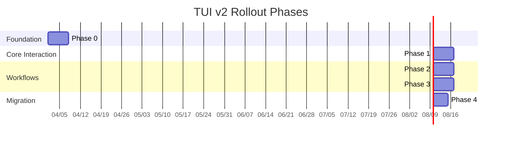

# Smithers TUI v2 — One-page direction

> [!IMPORTANT]
> **Core Decision**
> Build a chat-first Smithers control plane, not a prettier dashboard and not a direct-edit harness clone.

## Product shape

- Vertical workspace rail
- Unified activity feed
- Right-side inspector
- Workflow-first assistant behavior
- `@` for files/images
- `#` for workflows
- Global command palette
- Durable background broker for long-running work

## Default assistant behavior

The main agent should usually:
1. inspect existing `.smithers/workflows/`
2. reuse/refactor Smithers helpers
3. scaffold or edit a workflow/script
4. run it
5. monitor it
6. report artifacts and approvals back

Direct edits outside `.smithers/` should be unusual and mode-gated.

## Keyboard philosophy

- `Ctrl+O` global palette
- `Tab` / `Shift+Tab` move between regions
- `Esc` cancels/back
- `/` searches current pane or triggers slash command in composer
- `.` opens contextual actions
- `Ctrl+L` provider/profile picker
- `Ctrl+R` prompt history
- `Ctrl+G` external editor
- `@` file/image attach
- `#` workflow attach

It's important that we make all keyboard controls easily discoverable

## Architectural decision

Introduce a broker/service layer between the TUI and:
- Smithers runtime / DB
- harness adapters
- AI SDK providers
- filesystem / attachments
- notifications

Do not let React components spawn detached work directly.

## Ship sequence

> [!CAUTION]
> **Key Constraint:** Do not let React components spawn detached work directly. Ensure all orchestration runs through the UI Broker.
