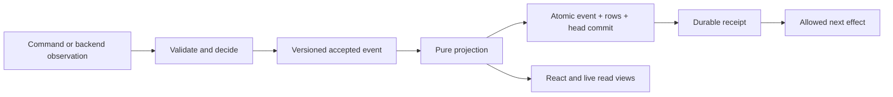

# How state works now

This is the source architecture of the state-event migration. The [completion ledger](state-events.md) records its verification and integration status. Deployment and migration rollout are separate operational steps.

The key change is that the frontend now has one reconstruction authority: a versioned local event journal and its verified checkpoint. The rows React reads are materialized answers from that authority. Chat output also has a backend acceptance and replay contract. Runtime lifecycle facts, normalized run views, and Plue issue/notification facts extend that model across several important seams.

The product still has several independent authorities. There is no global stream whose replay recreates a signed-in account, a running OS process, a remote repository and a collaborative document. Understanding those boundaries is more useful than calling everything “state.”

## Start with three distinctions

A **command** asks for an action. An **accepted fact** records what an authority accepted or observed. A **projection** computes a useful answer from accepted inputs.

For example, “approve this request” is a command. A local `command.intent.accepted` means the browser durably admitted an attempt; it does not mean the gateway approved anything. A committed gateway approval observation supplies that separate fact. The approval card joins the local submission state and the gateway observation.

A **stream transport** moves bytes. A **durable stream** retains facts with an identity, scope, ordering and replay contract. SSE, NDJSON and WebSockets do not imply durability by themselves.

Finally, “derived from current state” and “rebuildable from events” are different claims. A star icon is a join against `starredTargets`. Rebuilding that collection additionally requires its retained facts or a checkpoint plus later events.

## Where the bytes live

| Place | What it owns | What it does not establish |
|---|---|---|
| Browser-origin OPFS SQLite, `smithers-mvp.sqlite` | Application journal, checkpoints and persisted projections | Cross-device replication, remote acceptance, current account validity |
| Browser `localStorage`, `smithers-mvp.store` | Atomic fallback envelope, backend/schema bookkeeping, pending input and private deletion obligations | A second independently current copy of the OPFS database |
| Degraded in-memory browser store | An explicitly nonsaving session isolated from the unavailable saved store | Any local crash/reload durability, including its command receipts |
| Worker turn journal, inside the existing turn Durable Object namespace | Accepted chat legs, committed output batches, replay cursor and retirement | The original provider’s uncommitted output or an external tool’s outcome |
| Native `<stateDir>/chat-journal/turns.sqlite` | The same durable chat protocol for the local host | The browser’s UI history or arbitrary filesystem contents |
| Native repository files, JSON stores, keychain and processes | Source files, repository grants, agent definitions, credentials, PTYs and daemon ownership | A resource that can safely be recreated by replaying a UI event |
| Native target JSONL at `<repo>/.flows/ui/runs/<runId>.jsonl` | Committed target lifecycle/output evidence, under explicit output caps | Unlimited logs or the strict app-journal corruption contract |
| Runtime control and execution stores/journals | Run decisions, approvals, native execution, protected action results and ownership | One transaction spanning separate control/native databases |
| Tutorial coordinator SQLite | Accepted tutorial facts, derived run/checkpoint caches and execution claims | Automatic takeover of an already claimed external operation |
| Plue PostgreSQL | Product-domain rows and their migrated fact/revision journals | Provider-owned infrastructure, Git/jj contents, or identity/billing data held elsewhere |

The native WebView has browser-origin storage too. Its stable loopback origin preserves access to those bytes; the native state directory is a separate storage layer. Backend selection is sticky: a failed OPFS open cannot silently substitute an older localStorage store. [Browser persistence](persistence.md), [native chat storage](../src/bun/NativeTurnJournal.ts).

The generic runtime stores control and execution in `<root>/.flows/control.db` and `<root>/.flows/engine.db`. An explicit `stateRoot` moves both databases and their WAL/SHM files under that directory. The coding host now defaults to `<parent(root)>/.smithers-coding-state/<basename(root)>/.flows/`, outside the served checkout; `--state-dir` or `SMITHERS_CODING_STATE_DIR` overrides it. Registry, grants and execution workspaces retain their own roots. Location selection does not migrate existing databases: using old in-checkout history requires explicitly selecting that location and its documented in-root opt-in. The two databases remain separate transaction authorities. [Native store wiring](../../../packages/smithers/src/internal/NativeControl.ts), [coding host location policy](../../../flows/coding/state.ts).

## The complete frontend collection map

There are **43 domain projections**: 41 persisted collections plus two per-launch collections. Four additional private collections hold application event authority. Those counts distinguish the view roster from physical persistence. Per-launch views reset at boot; their accepted observations can still appear in retained event history until compaction or privacy erasure.

`repos` means native repositories; `repositories` means cloud inventory. UI `workspaces` and `branches` describe presentation/history. `cloudWorkspaces` describes remote execution workspaces. They are not interchangeable. Derived live card/index collections are additional ephemeral read views, not durable authorities. [Exact roster](../src/mainview/state/AppStore.ts), [pure projection schemas](../src/mainview/state/AppProjection.ts).

## What one frontend change does

With OPFS or localStorage, the normal path is:

The projector covers 134 validated transition types. Live dispatch, rebuild, checkpoint replay and verification use that same function. Decision time, actor, identity and relevant environment are recorded inputs. Explicitly clearing an optional patch field survives event encoding; ordinary JSON omission cannot erase that distinction.

The interface can show optimistic state. Command work waits for the relevant local receipt. If persistence fails, dependent optimistic work is rejected. Replay never invokes a model, command, filesystem action or provider. Console diagnostics belong to newly committed live transitions and do not rerun during recovery.

The saved-store receipt contract applies to OPFS and the localStorage fallback; the tests establish named reload, process-crash and transaction boundaries, not physical power-loss guarantees. In the explicitly nonsaving memory mode, a receipt acknowledges an in-memory write. Commands are not categorically blocked, so local history and replay capabilities can be lost on reload. The existing UI warns that the session will not be saved. Whether to prohibit consequential work in that mode remains a product policy decision.

Pending input has three small recovery stores: composer text, Wiki edits, and supported card/star edits. Each records its original actor, stream ID, verified committed prefix hash, workspace, branch and conversation. These records cannot override the journal. Boot verifies the journal first, validates the pending input against its original scope, admits a normal semantic event, and waits for durability before exposing recovered state. Recovery for an inactive branch updates that branch’s saved state without navigating there. Foreign, stale, malformed or unscoped records cannot become accepted state. Exact-record cleanup protects a newer edit from an older receipt; privacy rotation erases all three stores.

Human `form.set` has a synchronous preparation before its command receipt, so rapid edits survive an immediate reload. It uses the same field validation as the real handler, retains the command identity, and merges individual edited fields without changing accepted rows. Refused or settled commands cannot resurrect pending input. Agent input waits for authorization before ordinary event dispatch; a recovery record carries no executable grant. Form submission and external effects still wait for their durable receipts. Generic card recovery excludes environment secrets and approval capability envelopes. HumanTask answer text uses a separate tagged value in the same pending-input slot, anchored to the normalized gate identity and exact question fingerprint. A changed question, decision, account, command outcome, or active context prevents an old draft from being restored.

HumanTask answer drafts are normalized gate state. The individual approval card and inbox join the same `answerDraft` value; every keystroke uses `form.set` with the exact question fingerprint and records `approval.answer.changed`. The human-only handler refuses agent edits. Submission validates prose, booleans, current choices or JSON against the observed question and waits for the answer’s receipt before the decision request. A re-asked question clears the old draft and submission identity, so a delayed response cannot decide its replacement. The textarea holds only editing that is still waiting for its receipt and restores its value from the projection on remount.

The old `transitions` and `toolCalls` tails remain bounded diagnostics. A transition diagnostic keeps at most 2 KiB of UTF-8 payload; elision affects that diagnostic copy, never the complete accepted event input. The authoritative event history is separate. Explicit compaction replaces a covered prefix with a verified checkpoint; it does not pretend to preserve individual events before that checkpoint. Legacy installations begin from a labeled baseline of validated surviving state, not invented historical events.

Normalized SQLite loads first admit metadata against a 64 MiB UTF-8 key/value budget
per collection, then fetch admitted values in bounded pages. Every app collection requires complete admission; oversized
state refuses with its source preserved. Chain retention retires whole
lineages with durable tombstones, while the currently appending lineage keeps
its prefix. Its budget is recorded in events, so historical replay never uses
today's configuration. App event compaction remains an explicit verified
checkpoint operation; a checkpoint whose domain state exceeds the load budget
requires recovery rather than silent truncation. The human reset flow closes
the dispatcher and holds the same cross-tab writer lease during erasure.

Verification checks scope, versions, ordering, hashes, checkpoint/head consistency and the actual served rows. Event format version 1 and projector version 2 are separate contracts. Changes to `APP_PROJECTION_SCHEMAS` row shapes or the transition set must bump `APP_PROJECTOR_VERSION`. An older-projector head/checkpoint pair establishes an explicit upgrade boundary: validated persisted rows seed a new stream with reason `projector-upgrade`; replacement authority, old-event deletion and old-stream retirement commit atomically. Newer projectors are refused with a typed version error. Same-version verification remains strict, so stripping an unknown checkpoint field without a version bump still fails verification. Valid history can repair damaged caches. Invalid authoritative history is preserved and refused. A hash detects inconsistency under the storage ownership assumptions; it is not an independent signature proving that a malicious writer could never replace the entire history. [Event protocol](../src/mainview/state/AppEventStream.ts), [intent contract](command-intents.md).

Replay verification proves consistency with accepted facts; it does not prove every acceptance decision was correct. The integration tests caught a concrete example: boot treated a durable frame URL as a request to restart the tutorial. The stored cards and frames survived, and the restart replayed correctly, but accepting that restart was wrong. Route/command behavior tests and state integrity checks are complementary. A frame fork now waits for its persistence receipt before publishing its URL and completion notice. That continuation also checks account ownership: sign-out can preserve a root frame identity, so an unchanged location alone cannot authorize a late completion.

## Trace a chat through interruption

1. The browser persists the logical attempt, leg identity and private replay capability.
2. The host accepts that stable leg and grants one producer permission to run inference. A matching repeated POST returns existing metadata; it cannot obtain another producer grant.
3. The host commits output batches before publishing them. Each batch names its predecessor and exact frame positions.
4. The browser verifies and folds the whole batch, then commits its resulting state and applied cursor together.
5. After a lost connection or reload, the browser reads after its own committed cursor. It drains bounded pages and deduplicates already applied batches.
6. A requested tool first receives a durable local start/intent receipt. Saved results feed later legs without running the tool again.

Three acknowledgements matter: local intent, backend acceptance, and local application. None can stand in for the others. The server’s head is not proof that the browser applied that output.

If a process dies after accepting work but before saving its result, the honest answer can be unknown. The current client never launches replacement inference to fill missing history. A hard-killed producer with no terminal fact can leave a nonterminal prefix indefinitely; Stop and explicit retry remain available. An accepted tool without a saved result is likewise not automatically repeated. This is deliberate protection against duplicate work, with an explicit liveness limitation. [Full recovery matrix](http-turn-recovery.md), [backend protocol](../../server/docs/agent-turn-events.md).

## Runs, approvals and read-time derivations

`runtimeRuns` is keyed by repository, workspace and run. `runtimeApprovals` additionally names the exact request and digest. The same pure card projection serves current cards, headers and controller decisions. Saved historical cards carry an explicit revision snapshot. Runtime observations no longer need independent updates to every card copy.

Execution status and observer status are separate. A run can be running while this browser reconnects. Health additionally depends on recorded evidence, incarnation and evaluation time: an observation can expire without a new lifecycle event.

Polling is not itself a new fact. The run pump validates a response against immutable committed evidence before deciding whether it learned anything. Optimistic rows cannot justify a no-op decision or an applied cursor. Unchanged evidence produces no event; a transcript append records only its new suffix, anchored to the previously applied length and cursor. A newer full snapshot can replace a derived transcript only under the explicit projection-cursor contract. An expiry crossing is a meaningful health change and records the evaluation time. These rules reduce repeated history storage while preserving replay. Explicit accepted commands still enter history even when their visible values match, so no-op polling and event compaction solve different growth problems.

The runtime has separate control and native execution evidence. Complete facts can establish verified lifecycle provenance; bridge lag, legacy history or mismatches remain explicitly observed/unverified. Redacted public facts cannot replace protected resolver tokens or executable action results. Stable call identities distinguish overlapping calls of the same name, including reverse-order completion. Legacy events without identity retain a clearly limited fallback.

Native execution facts also reconstruct questions in attached child executions. Tree metadata records attachment policy, a redacted question, named wait point and resolver-token digest. The fold derives open human waits and compares them with a coherent execution observation; each source reports its covered baseline and sequence bounds. Older facts cannot imply question coverage before that boundary. The gateway joins the verified question to the currently held protected token before accepting an answer. A historical question can explain why execution waited; it cannot authorize an answer after the operational wait has ended. Answered waits disappear from the current inbox, while retained facts preserve their observations.

Other successful derivations are smaller and equally useful: stars join `starredTargets`; read state joins exact-version `notificationReceipts`; tags join current notification observations; Wiki link rails and graphs derive from a chosen `worldDocuments` revision. These changes remove duplicate writes into card histories. [Runtime projection](../src/mainview/state/RuntimeProjection.ts), [read decorations](state-events.md).

## Cloud agent sessions use a separate stream

Cloud agent cards observe Plue's repository-scoped agent-session API. They do not use the browser assistant's HTTP-turn journal. The server owns the complete transcript; the card persists a window of the newest 200 messages. The route caps reads at 100 rows, so a snapshot reads up to three aligned pages around the session's observed message count and retains the newest window. This also works for completed sessions that open no SSE connection.

The SSE message ID is the persisted message row ID. Stream observations are committed sequentially before a later frame or reconnect may advance the applied cursor. Reconnection reads after the IDs in the committed card; it never repeats the POST that launches a run. A failed local write stops observation and preserves the previous committed prefix on reopen.

Two server details require snapshot repair. Cursor zero means live-only at the server's connection head, so the client reads again after connection readiness to capture a first message committed between its initial empty read and connection. Status wakeups carry no replay ID. An active watcher therefore also performs bounded snapshot repair every 15 seconds; it can recover a dropped terminal wakeup and the final message. Snapshot and SSE writes share an ordered receipt queue. Account replacement, disposal and a superseding act retire the watcher; delayed reads cannot repopulate the old account's state.

A restored card states the last observed server status. It is not a connection-health indicator. Reopening the session through its view command refreshes the snapshot and starts observation while active; saved cloud-agent cards do not currently start every watcher automatically at app boot. Plue session deletion and provider execution retain their own authorities. These snapshots and replay reads recover observations, never authorization to launch an ambiguous run again.

## Plue synchronization and what remains a snapshot

Plue’s durable SSE drains page through committed sources, use notifications as wakeups, periodically repair missed wakeups, and retain the last cursor on read/delivery failure. Writer ordering makes the acknowledged frontier meaningful only after every relevant legacy SSE writer uses the fenced queries and old transactions have drained. Trigger capture in the new issue/notification fact feeds does not establish ordering for older workflow or agent writers. Workflow replay includes both log sources. The web and native proxies preserve reconnect metadata.

The new notification facts cover owned notification row lifecycle. Issue state facts cover raw issue rows and label/assignee memberships. Atomic database triggers capture accepted changes, including older SQL writers; migration establishes an explicit baseline. Current permissions and source visibility are separate inputs. An issue’s comment bodies, reactions, label definitions, milestone metadata, linked changes and external integrations are not magically included in its raw-row fold.

These new fact endpoints are backend capabilities. The SPA still uses existing snapshot/refresh adapters for those domains; it has not become a general subscriber to every Plue fact feed. Likewise, gateway snapshot polling can retrieve an event-derived run view even where the web relay does not expose subscriptions. This remains a worthwhile next integration step, with scope changes and reset handling designed explicitly. `plue/docs/internal/issue-state-facts.md`, `plue/docs/internal/notification-facts.md`.

Wiki has a different protocol: durable local Yjs state, pending update identities and verified acknowledgements. Its SSE revision event announces a changed document; it does not contain the complete document. Pending edits must merge with fetched causal state. Graphs can be derived; the pending-edit protocol cannot be replaced by folding revision numbers.

## Other app state that still matters

The UI Worker retains five existing Durable Object namespaces. The turn namespace now also contains durable chat acceptance and output. Gateway records still own protected connection/provisioning leases; turn-rate windows are mutable quota counters; client-error reports are a bounded diagnostic ring; recommendation records are a bounded log whose outcomes can be updated. Those are separate contracts, not additional copies of the browser journal. Identity and billing remain upstream authorities. [Worker identity and storage boundaries](../../server/src/workerIdentity.ts).

Billing plan catalogs, the current plan and sandbox usage enter `billingAccounts` through `billing.plans.loaded`. They are attributed backend snapshots that replay locally and erase on account replacement. A saved quota or checkout option does not authorize backend work or payment: current server enforcement and the human checkout gesture remain separate. Plan reads and limit cards wait for their persistence receipts; delayed reads or checkout responses cannot act for a replaced account.

| App or subsystem | Current authority and derivation boundary |
|---|---|
| Tutorial coordinator/executor | SQLite facts derive tutorial run/checkpoint views; execution claims guard external work. Finished data has a short retention horizon. A claimed operation interrupted before its result needs reconciliation. |
| Review CLI/GitHub action | Durable execution and action results live in `.smithers-review/review.db`; the HTML walkthrough derives from those results. Publication is a separate external effect. |
| Bug/onboarding Worker | KV owns reports, answers, nominations and subscription state. A repository Durable Object owns first completion and mirrors it into KV. Nomination counters/leaderboards remain a useful future event-projection candidate. |
| Native terminal | The OS owns the process and PTY. A bounded output tail and observed lifecycle can drive a view, but replaying output cannot recreate the original live process. |
| Static status/site/docs | Committed artifacts and build/deployment versions own the published content. The main app island uses the frontend store described above. |
| Plue Observe/admin/status | Observe composes telemetry and infrastructure APIs, with ephemeral sessions/caches; admin is an API client; status renders polled snapshots. They do not share the app's browser journal. |
| Integration workers | Provider cursors, mirrored rows, webhook receipts and retry state belong to their integration domain. They must not be inferred from a card's refresh timestamp. |

## Privacy and the limits of reconstruction

Account replacement and event-driven `app.reset` rotate local event authority and erase private live/history/recovery bytes. Before readable chat capabilities disappear, the browser durably stages delete-only proofs. An offline outbox retries remote erasure until acknowledgement. Native acknowledgement requires the SQLite WAL to be drained; a pinned reader can keep erasure pending.

The raw local recovery reset has a narrower input boundary: it preserves
already-validated delete-only obligations in a separate queue that fresh boot
can drain, while dropping the old baseline and privacy marker. It cannot
reconstruct unknown obligations from corrupt history. The queue never appears
in recovery exports, agent context or application event snapshots.

This covers identities retained by the client. It does not discover lost journals from an account-wide server inventory, recall downloaded exports, or erase OS/provider backups. Workspace runtime history and external resource stores have their own ownership/retention policies.

The remaining architectural work is now easier to name: connect additional backend fact feeds where freshness warrants it; extend fact completeness to additional product domains; design producer-death reconciliation and destination idempotency where automatic recovery is required; add explicit retention/compaction policies; and add integrity and missing-history detection for target JSONL, whose tolerant reader also applies to new journals. None should be hidden behind a generic “synced” flag.

To evaluate a new state field, ask: who accepts writes, what durable receipt proves acceptance, which facts reconstruct it, what cursor names the applied prefix, what survives retention, what happens after a crash, and what must be erased on an ownership change. If those answers are explicit, keeping a fast materialized table is compatible with an event-derived architecture.

