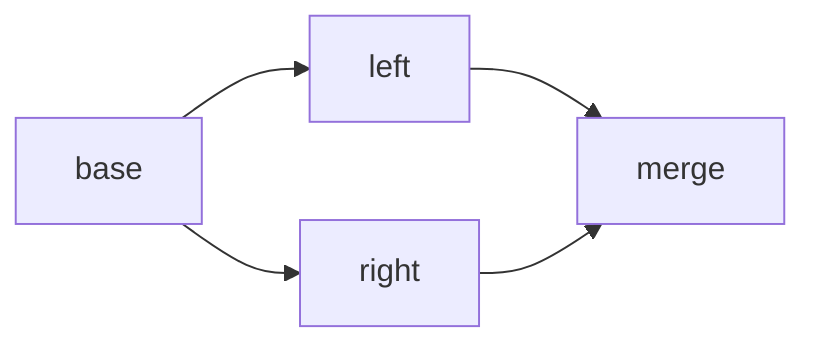

Smithers uses **type hints** to define dependencies between workflows. No manual wiring required.

## How Dependencies Work

When a workflow parameter is a Pydantic model, Smithers looks for a workflow that produces that type:

```python
class AnalysisOutput(BaseModel):
    files: list[str]

class FixOutput(BaseModel):
    changes: list[str]

@workflow
async def analyze() -> AnalysisOutput:
    return await claude("Analyze the code", output=AnalysisOutput)

@workflow
async def fix_issues(analysis: AnalysisOutput) -> FixOutput:
    # `analysis` is automatically provided by the `analyze` workflow
    return await claude(
        f"Fix issues in: {analysis.files}",
        output=FixOutput,
    )
```

When you call `build_graph(fix_issues)`, Smithers:

1. Sees that `fix_issues` needs `AnalysisOutput`
2. Finds `analyze` (which produces `AnalysisOutput`)
3. Adds `analyze` to the graph with an edge to `fix_issues`

## Multiple Dependencies

Workflows can depend on multiple outputs:

```python
@workflow
async def final_report(
    analysis: AnalysisOutput,
    fixes: FixOutput,
    review: ReviewOutput,
) -> ReportOutput:
    return await claude(
        f"""
        Generate a report:
        - Analysis: {analysis.summary}
        - Fixes: {len(fixes.changes)} changes
        - Review: {'approved' if review.approved else 'rejected'}
        """,
        output=ReportOutput,
    )
```

## Dependency Resolution

Smithers resolves dependencies recursively:

```python
@workflow
async def step1() -> A:
    ...

@workflow
async def step2(a: A) -> B:
    ...

@workflow
async def step3(b: B) -> C:
    ...

@workflow
async def step4(c: C) -> D:
    ...

# build_graph(step4) includes all 4 workflows
graph = build_graph(step4)
print(graph.levels)
# [['step1'], ['step2'], ['step3'], ['step4']]
```

## Diamond Dependencies

Smithers handles diamond patterns correctly:

```python
@workflow
async def base() -> Base:
    ...

@workflow
async def left(b: Base) -> Left:
    ...

@workflow
async def right(b: Base) -> Right:
    ...

@workflow
async def merge(l: Left, r: Right) -> Final:
    ...
```

The graph:



`base` is only executed **once**, even though both `left` and `right` depend on it.

## Missing Dependencies

If no workflow produces a required type, Smithers raises an error:

```python
class OrphanOutput(BaseModel):
    value: str

@workflow
async def needs_orphan(orphan: OrphanOutput) -> Result:
    ...

graph = build_graph(needs_orphan)
# ValueError: Workflow 'needs_orphan' depends on OrphanOutput, 
#             but no workflow produces that type
```

## Circular Dependencies

Circular dependencies are detected and rejected:

```python
@workflow
async def a(c: C) -> A:
    ...

@workflow  
async def b(a: A) -> B:
    ...

@workflow
async def c(b: B) -> C:
    ...

graph = build_graph(a)
# ValueError: Circular dependency detected among: {'a', 'b', 'c'}
```

## Non-Workflow Parameters

Not every parameter needs to be a dependency. Regular parameters are ignored:

```python
@workflow
async def greet(
    analysis: AnalysisOutput,  # This IS a dependency
    greeting: str = "Hello",   # This is NOT a dependency
) -> GreetingOutput:
    ...
```

Only parameters with Pydantic model types are treated as dependencies.

## External Inputs

Workflows can also accept external inputs (not from other workflows):

```python
@workflow
async def analyze(file_path: str) -> AnalysisOutput:
    return await claude(f"Analyze {file_path}", output=AnalysisOutput)

# Provide external input at build time
graph = build_graph(analyze, inputs={"file_path": "src/main.py"})
```

## Composition vs Dependencies

For complex patterns, consider using [workflow composition](/concepts/composition):

```python
from smithers import chain, parallel

# Instead of manual dependencies
pipeline = chain(analyze, implement, test)

# Or parallel execution
review = parallel(lint, test, security, collect_as=ReviewOutput)
```

## Best Practices

<AccordionGroup>
  <Accordion title="Design outputs for reuse">
    Think about what other workflows might need. Include useful fields.
  </Accordion>

  <Accordion title="Keep dependency chains shallow">
    Deep chains (A → B → C → D → E → F) are harder to debug. Consider parallelism.
  </Accordion>

  <Accordion title="Use diamond patterns for parallelism">
    If two workflows can run in parallel, have them depend on the same upstream workflow.
  </Accordion>

  <Accordion title="Use composition for complex patterns">
    When dependencies get complex, use `chain`, `parallel`, or `branch` for clarity.
  </Accordion>
</AccordionGroup>
