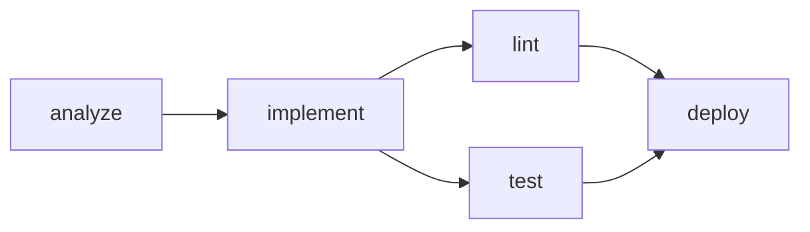
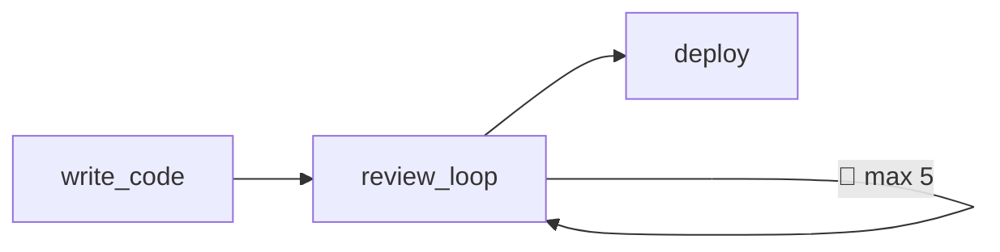

The **graph** is the core data structure in Smithers. It represents all workflows and their dependencies.

## Building a Graph

Use `build_graph` to create a graph from a target workflow:

```python
from smithers import build_graph

graph = build_graph(final_workflow)
```

Smithers automatically:
1. Walks the dependency tree from the target
2. Discovers all required workflows
3. Computes edges (dependencies)
4. Calculates execution levels for parallelism

## Graph Structure

A `WorkflowGraph` contains:

```python
@dataclass
class WorkflowGraph:
    root: str                           # Target workflow name
    nodes: dict[str, WorkflowNode]      # All workflows
    edges: list[tuple[str, str]]        # Dependency edges
    levels: list[list[str]]             # Parallelization groups
```

### Nodes

Each node represents a workflow:

```python
@dataclass
class WorkflowNode:
    name: str                           # Workflow function name
    output_type: type[BaseModel]        # What it produces
    dependencies: list[str]             # Names of workflows it depends on
    requires_approval: bool             # Human-in-the-loop?
    approval_message: str | None        # Message to show for approval

@dataclass
class RalphLoopNode(WorkflowNode):
    inner_workflow_id: str              # The workflow being iterated
    max_iterations: int                 # Safety limit
    until_condition: str                # Condition description
```

<Note>
Ralph loops are nodes in the graph that internally iterate. From the DAG's perspective, they're atomic — but each iteration is tracked in SQLite.
</Note>

### Edges

Edges are `(from, to)` tuples representing data flow:

```python
print(graph.edges)
# [('analyze', 'implement'), ('implement', 'test')]
```

### Levels

Levels group workflows that can run in parallel:

```python
print(graph.levels)
# [
#     ['analyze'],           # Level 0: runs first
#     ['lint', 'test'],      # Level 1: runs in parallel
#     ['deploy'],            # Level 2: runs last
# ]
```

## Inspecting a Graph

```python
graph = build_graph(deploy)

# See all workflows
print(graph.nodes.keys())
# dict_keys(['analyze', 'implement', 'lint', 'test', 'deploy'])

# See dependencies of a specific workflow
print(graph.nodes['deploy'].dependencies)
# ['lint', 'test']

# See execution order
for i, level in enumerate(graph.levels):
    print(f"Level {i}: {level}")
# Level 0: ['analyze']
# Level 1: ['implement']
# Level 2: ['lint', 'test']
# Level 3: ['deploy']
```

## Visualization

Smithers provides multiple visualization formats for workflow graphs.

### Mermaid Diagrams

Generate a Mermaid diagram:

```python
print(graph.mermaid())
```

Output:



### Styled Mermaid

Include status-based styling with colors:

```bash
smithers graph workflow.py --format mermaid-styled
```

### ASCII Art

View graphs directly in the terminal:

```bash
smithers graph workflow.py --format ascii
```

Output:

```
┌──────────┐
│ analyze  │ PENDING
└────┬─────┘
     │
     ▼
┌──────────┐
│implement │ PENDING
└────┬─────┘
     │
     ├─────────────┐
     ▼             ▼
┌─────────┐  ┌─────────┐
│  lint   │  │  test   │ PENDING
└────┬────┘  └────┬────┘
     │            │
     └─────┬──────┘
           ▼
     ┌──────────┐
     │  deploy  │ PENDING
     └──────────┘
```

### Tree View

Show dependency hierarchy:

```bash
smithers graph workflow.py --format tree
```

### Table Format

Show node details in a table:

```bash
smithers graph workflow.py --format table
```

### Ralph Loops in Diagrams

Ralph loops are rendered with a self-referential edge:



### In Notebooks

```python
from IPython.display import display, Markdown

display(Markdown(f"```mermaid\n{graph.mermaid()}\n```"))
```

### CLI Options

```bash
# Save to file
smithers graph workflow.py -o graph.md

# DOT format for Graphviz
smithers graph workflow.py --format dot -o graph.dot

# JSON for programmatic use
smithers graph workflow.py --format json

# Disable colors
smithers graph workflow.py --format ascii --no-color

# ASCII-only (no Unicode)
smithers graph workflow.py --format table --no-unicode
```

## Level Computation

Smithers uses topological sorting to compute levels:

1. **Level 0**: Workflows with no dependencies
2. **Level 1**: Workflows whose dependencies are all in Level 0
3. **Level N**: Workflows whose dependencies are all in Level < N

```python
# Example: Diamond pattern
#
#         ┌→ lint ──┐
# impl ───┤         ├→ deploy
#         └→ test ──┘

graph.levels = [
    ['implement'],      # Level 0
    ['lint', 'test'],   # Level 1 (parallel!)
    ['deploy'],         # Level 2
]
```

## Common Patterns

### Linear Chain

```python
# A → B → C → D
levels = [['A'], ['B'], ['C'], ['D']]
```

### Fan-Out

```python
# A → B, C, D (parallel)
levels = [['A'], ['B', 'C', 'D']]
```

### Fan-In

```python
# B, C, D → E
levels = [['B', 'C', 'D'], ['E']]
```

### Diamond

```python
#     ┌→ B ─┐
# A ──┤     ├→ D
#     └→ C ─┘
levels = [['A'], ['B', 'C'], ['D']]
```

## Best Practices

<AccordionGroup>
  <Accordion title="Visualize before running">
    Always check `graph.mermaid()` before executing expensive workflows.
  </Accordion>
  
  <Accordion title="Maximize parallelism">
    Design your graph so independent work is in the same level.
  </Accordion>
  
  <Accordion title="Keep graphs small">
    Large graphs are harder to debug. Consider breaking into sub-graphs.
  </Accordion>
</AccordionGroup>
