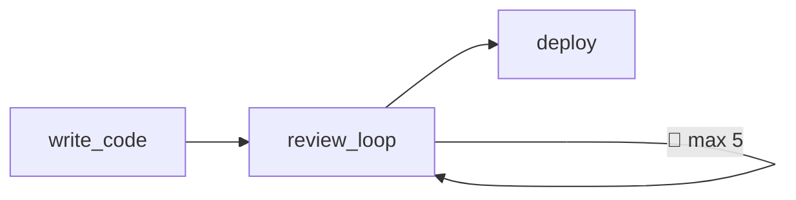

**Ralph loops** provide iteration without abandoning the DAG model. They're the Smithers answer to "how do I loop until approved?" without the complexity of state machines.

## Why Ralph Loops?

Agentic workflows often need iteration:
- "Review code until approved"
- "Refine output until quality threshold"
- "Retry until success"

Traditional DAGs don't support cycles. But arbitrary graph cycles (like LangGraph's state machines) introduce complexity that conflicts with Smithers' Bazel-inspired philosophy.

Ralph loops provide a middle ground: **declarative iteration that preserves the DAG**.

## Basic Usage

```python
from smithers import workflow, ralph_loop, claude, build_graph, run_graph
from pydantic import BaseModel

class CodeOutput(BaseModel):
    code: str
    approved: bool = False

class ReviewOutput(BaseModel):
    approved: bool
    feedback: list[str]

@workflow
async def review_and_revise(code: CodeOutput) -> CodeOutput:
    """One iteration: review, maybe revise."""
    review = await claude(f"Review this code:\n{code.code}", output=ReviewOutput)
    
    if review.approved:
        return CodeOutput(code=code.code, approved=True)
    
    revised = await claude(
        f"Revise based on feedback: {review.feedback}",
        output=CodeOutput,
    )
    return revised

# Create the Ralph loop
review_loop = ralph_loop(
    review_and_revise,
    until=lambda result: result.approved,
    max_iterations=5,
)

# Use like any other workflow
graph = build_graph(review_loop)
result = await run_graph(graph)
```

## How It Works

A Ralph loop is a **single node** in the DAG that internally iterates:

1. **Entry**: Loop receives input from upstream dependencies
2. **Iterate**: Execute the inner workflow with current state
3. **Check**: Evaluate the `until` condition on output
4. **Continue or Exit**: If condition is false and iterations < max, loop back to step 2
5. **Return**: Return the final output



From the graph's perspective, `review_loop` is atomic. The iterations happen inside.

## Parameters

```python
ralph_loop(
    workflow,           # The workflow to iterate
    until,              # Condition function: (output) -> bool
    max_iterations=10,  # Safety limit
)
```

### `until`

A function that receives the workflow output and returns `True` to stop:

```python
# Stop when approved
until=lambda r: r.approved

# Stop when score exceeds threshold
until=lambda r: r.quality_score >= 0.9

# Stop when no more issues
until=lambda r: len(r.issues) == 0
```

### `max_iterations`

Safety limit to prevent infinite loops. When reached, the loop returns the last output.

## Observability

Each iteration is tracked in SQLite with dedicated events:

- `LoopIterationStarted` — Emitted when an iteration begins
- `LoopIterationFinished` — Emitted when an iteration completes
- `LoopMaxIterationsReached` — Emitted if max iterations hit

### SQLite Schema

```sql
CREATE TABLE loop_iterations (
  run_id TEXT NOT NULL,
  loop_node_id TEXT NOT NULL,
  iteration INTEGER NOT NULL,
  input_hash TEXT NOT NULL,
  output_hash TEXT,
  status TEXT NOT NULL,
  started_at TEXT NOT NULL,
  finished_at TEXT,
  PRIMARY KEY (run_id, loop_node_id, iteration)
);
```

### Query Iterations

```sql
SELECT * FROM loop_iterations
WHERE run_id = ? AND loop_node_id = ?
ORDER BY iteration;
```

### Monitor with CLI

```bash
smithers watch ./cache.db --run <run_id>
# Shows: LoopIterationStarted {iteration: 0}
#        LoopIterationFinished {iteration: 0}
#        LoopIterationStarted {iteration: 1}
#        ...
```

### Iteration Caching

Individual iterations can be cached by iteration index + input hash. This allows resuming loops from the last successful iteration after failures.

## Nested Loops

Ralph loops can contain other Ralph loops:

```python
@workflow
async def inner_polish(doc: DocOutput) -> DocOutput:
    """Polish prose until fluent."""
    ...

@workflow
async def outer_review(doc: DocOutput) -> DocOutput:
    """Review structure, polish prose."""
    # Inner loop for polishing
    polished = await ralph_loop(
        inner_polish, 
        until=lambda d: d.fluency_score > 0.9,
        max_iterations=3,
    )(doc)
    
    # Then review structure
    return await claude(f"Review structure: {polished}", output=DocOutput)

# Outer loop for overall quality
full_pipeline = ralph_loop(
    outer_review,
    until=lambda d: d.approved,
    max_iterations=5,
)
```

## With Dependencies

Ralph loops work with Smithers' dependency system:

```python
@workflow
async def generate_code() -> CodeOutput:
    return await claude("Write fibonacci", output=CodeOutput)

@workflow
async def review_and_revise(code: CodeOutput) -> CodeOutput:
    # Takes CodeOutput as dependency
    ...

# The loop gets its input from generate_code
review_loop = ralph_loop(review_and_revise, until=..., max_iterations=5)

# Graph: generate_code → review_loop
graph = build_graph(review_loop)
```

## Comparison with LangGraph

| Aspect | Ralph Loops | LangGraph |
|--------|-------------|-----------|
| Graph model | DAG (loops are atomic nodes) | Cyclic graph |
| Complexity | Simple: one primitive | Complex: state machines |
| State | External (SQLite/files) | In-memory state dict |
| Visibility | Full iteration tracking | Custom state inspection |
| Philosophy | Bazel-like declarative | Flowchart-like imperative |

## Best Practices

<AccordionGroup>
  <Accordion title="Always set max_iterations">
    LLMs are unpredictable. Always have a safety limit.
  </Accordion>
  
  <Accordion title="Make until conditions clear">
    Use explicit boolean fields like `approved` rather than complex logic.
  </Accordion>
  
  <Accordion title="Keep inner workflows focused">
    Each iteration should do one thing: review, revise, check quality, etc.
  </Accordion>
  
  <Accordion title="Use nested loops sparingly">
    Deep nesting is hard to debug. Flatten when possible.
  </Accordion>
</AccordionGroup>

## Common Patterns

### Review Until Approved

```python
review_loop = ralph_loop(
    review_and_revise,
    until=lambda r: r.approved,
    max_iterations=5,
)
```

### Refine Until Quality Threshold

```python
refine_loop = ralph_loop(
    refine_output,
    until=lambda r: r.quality_score >= 0.95,
    max_iterations=10,
)
```

### Retry Until Success

```python
@workflow
async def call_api(request: RequestInput) -> ResponseOutput:
    try:
        result = await external_api(request)
        return ResponseOutput(success=True, data=result)
    except APIError:
        return ResponseOutput(success=False, data=None)

retry_loop = ralph_loop(
    call_api,
    until=lambda r: r.success,
    max_iterations=3,
)
```

### Converge Until Stable

```python
@workflow
async def iterate(state: State) -> State:
    new_state = await compute_next(state)
    return State(data=new_state, converged=(new_state == state.data))

converge_loop = ralph_loop(
    iterate,
    until=lambda s: s.converged,
    max_iterations=100,
)
```
