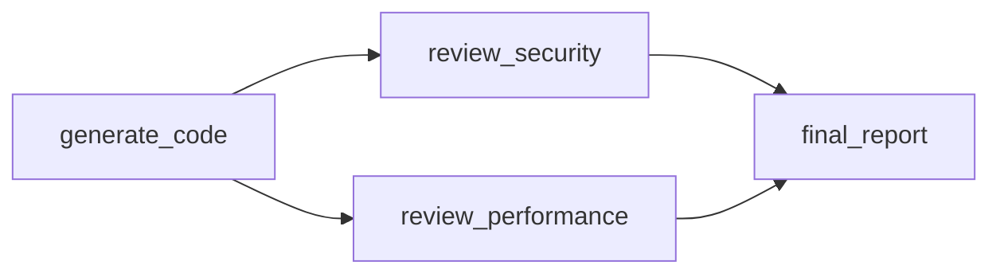

## Installation

```bash
pip install smithers
```

Or with uv:

```bash
uv add smithers
```

## Your First Workflow

Create a file called `hello.py`:

```python
from pydantic import BaseModel
from smithers import workflow, claude, build_graph, run_graph

# 1. Define your output schema
class GreetingOutput(BaseModel):
    greeting: str
    emoji: str

# 2. Create a workflow
@workflow
async def hello_world() -> GreetingOutput:
    return await claude(
        "Generate a friendly greeting for a developer",
        output=GreetingOutput,
    )

# 3. Build and run
async def main():
    graph = build_graph(hello_world)
    result = await run_graph(graph)
    print(f"{result.emoji} {result.greeting}")

if __name__ == "__main__":
    import asyncio
    asyncio.run(main())
```

Run it:

```bash
export ANTHROPIC_API_KEY=your-key
python hello.py
```

## Adding Dependencies

Now let's chain two workflows together:

```python
class AnalysisOutput(BaseModel):
    topic: str
    key_points: list[str]

class ExplanationOutput(BaseModel):
    summary: str
    analogy: str

@workflow
async def analyze() -> AnalysisOutput:
    return await claude(
        "Analyze the concept of dependency injection",
        output=AnalysisOutput,
    )

@workflow
async def explain(analysis: AnalysisOutput) -> ExplanationOutput:
    # `analysis` is automatically provided by Smithers!
    return await claude(
        f"Explain {analysis.topic} using the key points: {analysis.key_points}",
        output=ExplanationOutput,
    )

# Build from the final workflow - deps are resolved automatically
graph = build_graph(explain)
result = await run_graph(graph)
```

<Note>
Notice how `explain` takes `analysis: AnalysisOutput` as a parameter. Smithers automatically finds the `analyze` workflow (which produces `AnalysisOutput`) and wires them together.
</Note>

## Parallel Execution

When workflows don't depend on each other, they run in parallel:

```python
@workflow
async def review_security(code: CodeOutput) -> SecurityReview:
    return await claude("Review for security issues", output=SecurityReview)

@workflow
async def review_performance(code: CodeOutput) -> PerformanceReview:
    return await claude("Review for performance issues", output=PerformanceReview)

@workflow
async def final_report(
    security: SecurityReview,
    performance: PerformanceReview,
) -> Report:
    return await claude("Generate final report", output=Report)
```

The execution graph:



`review_security` and `review_performance` run **in parallel** because neither depends on the other.

## Using Tools

Give Claude access to tools for interacting with files:

```python
@workflow
async def fix_bugs() -> FixOutput:
    return await claude(
        "Find and fix bugs in the codebase",
        tools=["Read", "Edit", "Bash", "Grep"],
        output=FixOutput,
    )
```

## Iteration with Ralph Loops

For workflows that need to iterate (review until approved, refine until done):

```python
from smithers import ralph_loop

@workflow
async def review_and_revise(code: CodeOutput) -> CodeOutput:
    review = await claude(f"Review: {code.code}", output=ReviewOutput)
    if review.approved:
        return CodeOutput(code=code.code, approved=True)
    return await claude(f"Fix: {review.feedback}", output=CodeOutput)

# Loop until approved (max 5 tries)
review_loop = ralph_loop(
    review_and_revise,
    until=lambda r: r.approved,
    max_iterations=5,
)

graph = build_graph(review_loop)
result = await run_graph(graph)
```

<Note>
Ralph loops preserve the DAG model — the loop is a single node that internally iterates. Each iteration is tracked in SQLite for full visibility.
</Note>

## Caching

Skip unchanged work with SQLite caching:

```python
from smithers import SqliteCache

cache = SqliteCache("./smithers_cache.db")

# First run: executes all workflows
result = await run_graph(graph, cache=cache)

# Second run: skips workflows with unchanged inputs
result = await run_graph(graph, cache=cache)  # ⚡ Instant
```

## Next Steps

<CardGroup cols={2}>
  <Card title="Workflows" icon="sitemap" href="/concepts/workflows">
    Deep dive into workflow definitions
  </Card>
  <Card title="Composition" icon="layer-group" href="/concepts/composition">
    Chain, parallel, and branch workflows
  </Card>
  <Card title="Ralph Loops" icon="rotate" href="/concepts/ralph-loops">
    Declarative iteration for agentic workflows
  </Card>
  <Card title="Claude Integration" icon="robot" href="/features/claude">
    Advanced Claude usage with tools
  </Card>
  <Card title="Timeouts" icon="clock" href="/features/timeouts">
    Prevent runaway execution
  </Card>
  <Card title="Monitoring" icon="chart-line" href="/features/monitoring">
    Prometheus metrics and WebSocket updates
  </Card>
</CardGroup>
